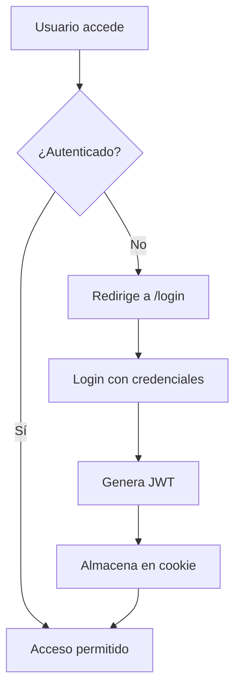
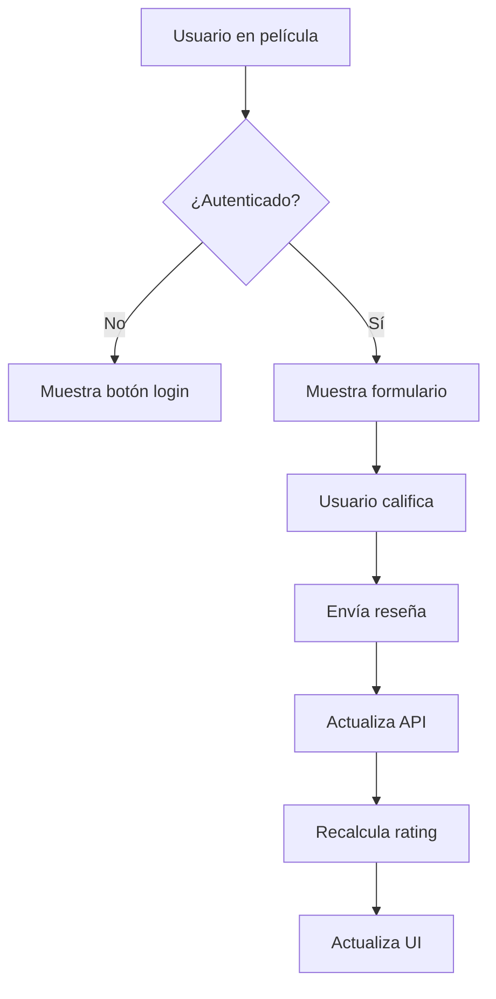

# 🎬 CineReview - Plataforma de Reseñas de Películas

## 📖 Descripción del Proyecto

**CineReview** es una aplicación web moderna para descubrir, calificar y reseñar películas. Los usuarios pueden explorar un catálogo de películas, crear reseñas detalladas con calificaciones de 1-10 estrellas, y gestionar su perfil personalizado con estadísticas de actividad.

### ✨ Características Principales

- 🔐 **Sistema de Autenticación** - Login/logout con JWT y middleware de protección
- 🎭 **Catálogo de Películas** - Navegación intuitiva con información detallada
- ⭐ **Sistema de Reseñas** - Calificaciones interactivas y comentarios textuales
- 👤 **Perfiles de Usuario** - Estadísticas personalizadas y gestión de reseñas
- 🏆 **Rankings** - Clasificaciones dinámicas basadas en calificaciones
- 📱 **Diseño Responsivo** - Interfaz optimizada para todos los dispositivos
- 🔍 **SEO Optimizado** - Metadatos dinámicos para cada película

## 🛠️ Stack Tecnológico

### Frontend Framework
- **Next.js 15.5.0** - Framework React con App Router y Turbopack
- **React 19.1.0** - Biblioteca de interfaz de usuario
- **Tailwind CSS 4** - Framework CSS utilitario para diseño
- **Lucide React** - Iconografía moderna y consistente

### Estado y Datos
- **Redux Toolkit** - Gestión de estado global predictible
- **JSON Server** - API REST simulada para desarrollo
- **Jose** - Manejo de tokens JWT para autenticación

### Herramientas de Desarrollo
- **ESLint** - Linting y calidad de código
- **Turbopack** - Bundler ultrarrápido para desarrollo
- **Concurrently** - Ejecución paralela de scripts

## 🏗️ Arquitectura del Proyecto

### Estructura de Carpetas
```
proyectofinalNext/
├── app/                    # App Router de Next.js
│   ├── api/               # API Routes
│   │   ├── session/       # Gestión de sesiones
│   │   └── logout/        # Endpoint de logout
│   ├── login/             # Página de autenticación
│   ├── movies/            # Páginas de películas
│   │   └── [id]/          # Página dinámica de película
│   ├── profile/           # Perfil de usuario
│   ├── rankings/          # Rankings de películas
│   └── globals.css        # Estilos globales
├── components/            # Componentes reutilizables
│   ├── auth/             # Componentes de autenticación
│   ├── general/          # Componentes generales
│   ├── movies/           # Componentes específicos de películas
│   └── ui/               # Componentes de interfaz
├── hooks/                # Custom React Hooks
├── lib/                  # Utilidades y configuraciones
├── services/             # Servicios de API
├── store/                # Configuración de Redux
└── data/                 # Datos estáticos
```

### Patrones de Arquitectura

#### Server/Client Components
- **Server Components**: Páginas con `generateMetadata` para SEO
- **Client Components**: Interactividad y estado del usuario
- **Separación clara**: Optimización de rendimiento y SEO

#### Estado Global con Redux
- **authSlice**: Gestión de autenticación y usuario
- **moviesSlice**: Catálogo de películas en caché
- **Persistencia**: Estado mantenido entre sesiones

#### Middleware de Autenticación
- **Protección de rutas**: Verificación automática de JWT
- **Redirección inteligente**: Navegación basada en estado de auth

## 🔄 Flujo de Datos y Navegación

### Flujo de Autenticación


### Flujo de Reseñas


## 📊 Funcionalidades Detalladas

### Sistema de Reseñas
- **Calificaciones**: Escala de 1-10 estrellas interactivas
- **Comentarios**: Texto opcional para reseñas detalladas
- **Edición**: Los usuarios pueden modificar sus reseñas
- **Validación**: Prevención de reseñas duplicadas
- **Agregación**: Cálculo automático de ratings promedio

### Gestión de Usuarios
- **Autenticación JWT**: Tokens seguros con expiración
- **Perfil dinámico**: Estadísticas automáticas de actividad
- **Protección de rutas**: Middleware automático
- **Persistencia**: Estado mantenido entre sesiones

### SEO y Metadatos
- **Metadatos dinámicos**: Generados por película
- **Open Graph**: Optimización para redes sociales
- **Twitter Cards**: Previsualizaciones enriquecidas
- **Sitemap dinámico**: URLs indexables

## 🚀 Instalación y Configuración

### Prerrequisitos
- Node.js 18+ 
- npm o yarn

### Instalación
```bash
# Clonar repositorio
git clone https://github.com/juantoranzos/proyectofinalNext.git
cd proyectofinalNext

# Instalar dependencias
npm install

# Configurar variables de entorno
cp .env.example .env.local
# Editar .env.local con tus configuraciones
```

### Variables de Entorno
```env
# .env.local
JWT_SECRET=tu_clave_secreta_jwt
NEXT_PUBLIC_API_URL=http://localhost:3001
```

### Comandos de Desarrollo
```bash
# Desarrollo completo (Next.js + JSON Server)
npm run dev:all

# Solo Next.js
npm run dev

# Solo API (JSON Server)
npm run json-server

# Build de producción
npm run build

# Iniciar producción
npm start
```

## 🌟 Características Técnicas Avanzadas

### Optimizaciones de Rendimiento
- **Turbopack**: Build ultra-rápido en desarrollo
- **Server Components**: Renderizado del servidor
- **Lazy Loading**: Carga bajo demanda de componentes
- **Image Optimization**: Optimización automática de imágenes

### Experiencia de Usuario
- **Loading States**: Indicadores de carga
- **Error Boundaries**: Manejo elegante de errores
- **Responsive Design**: Adaptable a todos los dispositivos
- **Accesibilidad**: Controles de teclado y lectores de pantalla

### Desarrollo y Mantenimiento
- **TypeScript-ready**: Preparado para migración
- **ESLint**: Reglas de calidad de código
- **Estructura modular**: Componentes reutilizables
- **Git Flow**: Ramas por features

## 🔄 Estados y Transiciones

### Estados de Autenticación
- **No autenticado**: Acceso limitado, redirección a login
- **Autenticando**: Loading state durante verificación
- **Autenticado**: Acceso completo a funcionalidades
- **Sesión expirada**: Re-autenticación automática

### Estados de Reseñas
- **Sin reseña**: Formulario vacío para nueva reseña
- **Con reseña**: Modo edición con datos pre-cargados
- **Enviando**: Loading state durante submit
- **Error**: Manejo de errores con retry

## 🎯 Casos de Uso Principales

1. **Descubrimiento de Películas**
   - Navegación por catálogo
   - Visualización de detalles
   - Lectura de reseñas existentes

2. **Creación de Reseñas**
   - Autenticación requerida
   - Calificación con estrellas
   - Comentario opcional
   - Edición posterior

3. **Gestión de Perfil**
   - Visualización de estadísticas
   - Historial de reseñas
   - Gestión de cuenta

4. **Exploración de Rankings**
   - Películas mejor calificadas
   - Filtros por género
   - Ordenamiento dinámico

## 📈 Métricas y Analytics

### Datos Rastreados
- Número total de reseñas por usuario
- Rating promedio otorgado por usuario  
- Películas más reseñadas
- Tendencias de calificación

### KPIs del Sistema
- Tiempo de carga de páginas
- Tasa de conversión login-to-review
- Engagement de usuarios activos
- Distribución de calificaciones

## 🔮 Roadmap Futuro

### Features Planificadas
- [ ] Sistema de recomendaciones basado en IA
- [ ] Comentarios anidados en reseñas
- [ ] Integración con APIs externas (TMDb)
- [ ] Sistema de notificaciones push
- [ ] Modo oscuro/claro
- [ ] PWA (Progressive Web App)

### Mejoras Técnicas
- [ ] Migración completa a TypeScript
- [ ] Tests unitarios e integración
- [ ] Cache estratégico con Redis
- [ ] Optimización de imágenes con CDN
- [ ] Monitoreo de performance (Sentry)

## 🤝 Contribución

Este proyecto sigue las mejores prácticas de desarrollo moderno y está diseñado para ser escalable y mantenible. Las contribuciones son bienvenidas siguiendo el flujo de Git establecido.

### Branch Strategy
- `main`: Producción estable
- `dev`: Integración de features
- `feature/*`: Desarrollo de nuevas funcionalidades
- `hotfix/*`: Fixes urgentes de producción

---

**Desarrollado con ❤️ usando Next.js 15 y las últimas tecnologías web**
